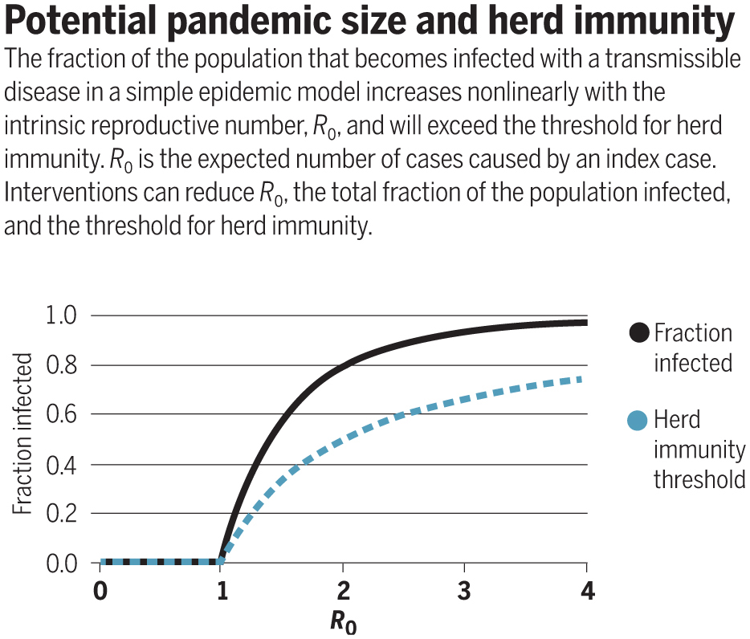
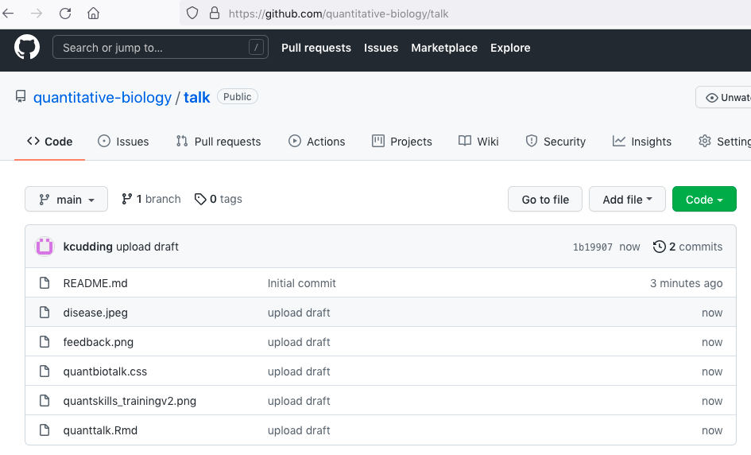
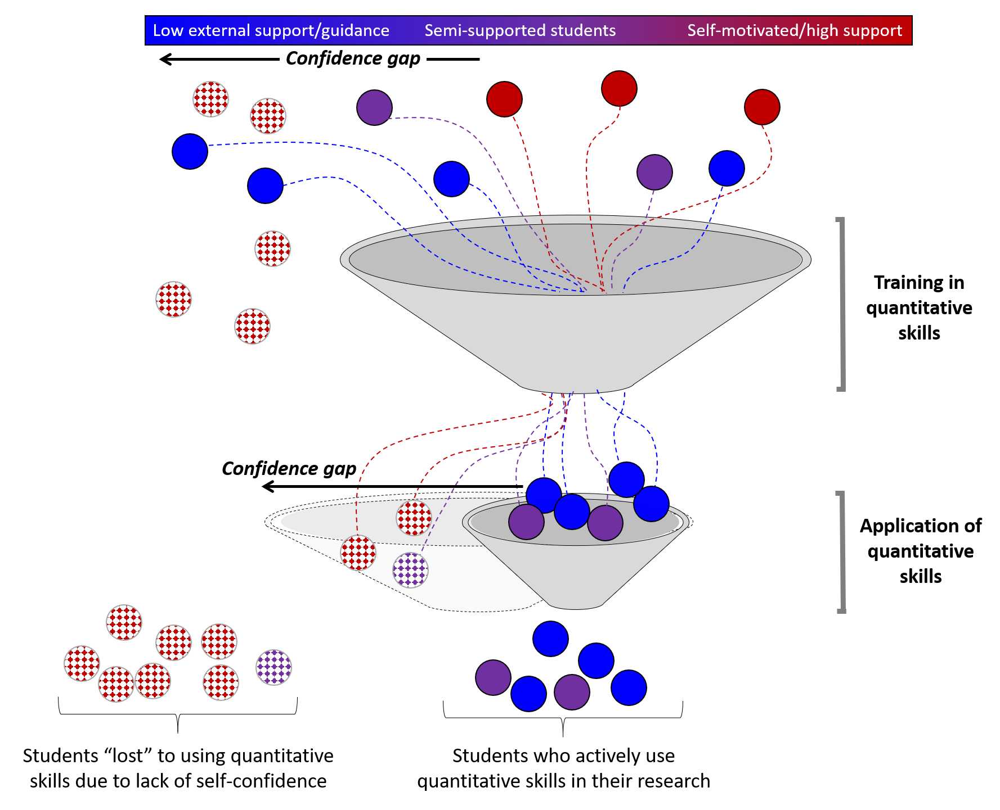
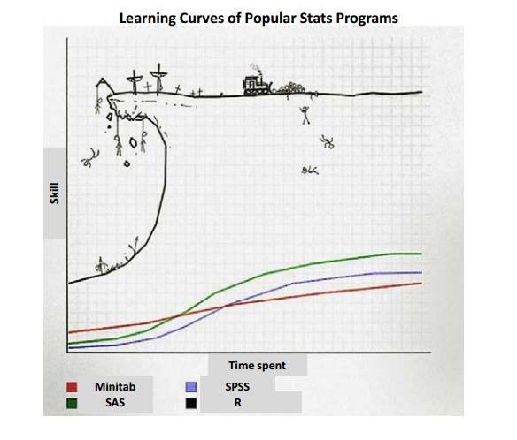

## Co-authors
Karen C. Abbott, Frederick R. Adler, Mehmet Aydeniz, Rene Dale, Louis J. Gross, Alan Hastings, Elizabeth A. Hobson, Vadim Karatayev, Alexander Killion, Aasakiran Madamanchi, Michelle Marraffini, Audrey McCombs, Widodo Samyono, Shin-Han Shiu, Karen H. Watanabe, Easton R. White (https://tinyurl.com/2pvvxe3n)

Andrew M. Edwards, Brian Ingalls  
(https://www.quantitative-biology.ca)

## Building quantitative skills for biologists
1. Why worry about quantitative skills?
2. Quantitative self-confidence and skill aquisition
3. Normalizing failure to build self confidence
4. Getting the training you need with limited time

## What are quantitative skills
- Math
- Stats
- Computation

- Open science & collaboration

## Math
- creating predictive models based on our knowledge of biology
 
(e.g., modelling disease dynamics)
  

Cobey, S. (2020). Modeling infectious disease dynamics. _Science_, _368_(6492), 713–714. [https://www.science.org/doi/full/10.1126/science.abb5659](https://www.science.org/doi/full/10.1126/science.abb5659)

## Stats
- handling complicated statistical analyses 
(e.g., looking at climate change impacts)

Cohen et al. (2018) used a trivariate meta-analysis across 1,011 time series to determine that phenology occurred earlier through time as temperature increased

Cohen et al. (2018). A global synthesis of animal phenological responses to climate change. _Nature Climate Change_, _8_(3), 224–228. [https://doi.org/10.1038/s41558-018-0067-3](https://doi.org/10.1038/s41558-018-0067-3)

## Computation
- using algorithms to assess big data  
(e.g., harnassing genetic data to inform medical issues)

Moradigaravand et al. (2018). Prediction of antibiotic resistance in Escherichia coli from large-scale pan-genome data. _PLoS Computational Biology_, _14_(12), e1006258. [https://journals.plos.org/ploscompbiol/article?id=10.1371/journal.pcbi.1006258](https://journals.plos.org/ploscompbiol/article?id=10.1371/journal.pcbi.1006258)

## Open Science

- providing data, source code and dynamic documents to make work completely reproducible 
- Note this document and figures provided at https:/github.com/quantitative-biology/talk

https://xkcd.com/2116/

## Apparent Problem: Lack of training
1. Young scientists with an interest in biology often self-select away from training in mathematics, statistics and computing
2. Training may not be required by their programs  
(e.g., only 1⁄4 of ecology PhD programs in the US even require a statistics course)

Touchon, J. C., & McCoy, M. W. (2016). The mismatch between current statistical practice and doctoral training in ecology. _Ecosphere_, _7_(8), e01394. [https://doi.org/10.1002/ecs2.1394](https://doi.org/10.1002/ecs2.1394)

## Is this really a problem?

- Most biology undergraduates are required to take an introductory calculus, statistics, or computational literacy class, 
- <b>BUT</b> the relationship between these quantitative techniques and biological concepts may not be obvious (Eaton and Highlander 2017)
- <b>AND</b> in spite of recommendations (National Research Council et al 2003), biology courses usually have little quantitative material 
- <b>FINALLY</b> in many cases institutions or departments lack faculty expertise in the relevant areas (Williams et al. 2019)

## That is, the during the training of undergraduate biologists we lie about the need for quantitative methods (by omission of course...)

And this is a problem because:

- Graduate students in biology may not even know they don't have the training they need, or
- if they have such training they may not connect it to doing biological research, or
- if they realize that they need training, they may not be able to find opportunties at their institution

<b>BUT</b> it is most likely that they will have the opportunity, but will lack the self-confidence to take full advantage of it 

# Quantitative self-confidence
## Quantitative self-confidence
- belief in one’s ability to perform particular tasks in a given setting (Bandura 1997)
- math self-confidence had a stronger positive impact on mathematics problem-solving than prior experience (Pajares and Miller 1994)
- individuals that underestimate their ability to perform quantitative tasks may develop learning aversion or anxiety (Chen Musgrove and Schussler 2020)

## New graduate students in biological research may lack quantitative self-confidence

Grad students may:

- have originally selected biology as undergrads because it was "less quantitative" 
- not have had opportunities to practice quantitative skills in their undergrad program
- believe they cannot develop these skills, or that it will be very difficult/uncomfortable/soul-destroying
 

$\rightarrow$ Consequently, may self-select away from learning these skills

## Self-confidence and equity-seeking groups
- quantitative skills are often tied to stereotypes related to gender and race
- can create a difficult barrier even for otherwise confident students (Flanagan and Einarson 2017)
- self-confidence of African-American PhDs in computing and mathematics was
strongly affected by interactions with peers, verbal encouragement, and a social community (Charleston and Leon 2016)

https://xkcd.com/385

## Two stages at which quantitative self-confidence is critical
1. students lacking self-confidence may self-select out of initial training opportunities, or 
2. may not actively use quantitative skills in their own research even after training

# To improve self-confidence, normalize failure
## It's time to stop hiding failure, and start building student self-confidence

- science publications hide all the failure that preceeded success
- reading a published paper, we may not realize that several quantitative analyses were tried and failed, were implemented improperly and redone, or failed to answer the research question and were abandoned 

- in addition, even sophisticated quantitative methods developed by distinguished researchers might fail on a student’s particular problem

- so students need the confidence to recognize when the method or its implementation is at fault, rather than engaging in self-criticism when a particular approach doesn’t work. 

## Failing to solve a problem is part of the research and learning process, not a commentary on self-identity

- many graduate students enter graduate school with very little experience in academic failure (Ward-Penny et al. 2011)
- learning quantitative methods requires students to engage with problems and fail to solve them at first
- it is essential that early failures do not undermine confidence so much that efforts to learn are abandoned 
 
 
 

“I am always doing that which I cannot do, in order that I may learn how to do it.”

    -Pablo Picasso

## Normalize failure to build self-confidence

Some techniques can help students can develop a resilience to failure, by building recognition that it is a normal part of acquiring new skills

- have students experience the need for knowledge in some areas after failing to solve a problem,
- normalize failure by ensuring students observe it in instructors (e.g., write code live in class, Johnston et al. 2019)
- have instructors and peers talk about statistics or mathematics anxiety
- be careful when assigning group work, because students with less experience need to do more quantitative work, not less, than experienced peers

## Positive feedback loop for skill acquisition and application
Overcoming self-confidence barriers by normalizing failure can initiate a positive reinforcing loop

- Lack of self-confidence can serve as a barrier between each stage (cross-hatching), but 
- if students persevere to the application stage, they are more likely to begin the process again, and 
- would likely face reduced roadblocks from lack of self-confidence

# Training vs Time
## I'm feeling confident! How do I learn to do all this stuff??
- there's way too much stuff!!
- you will not be able to do it all, collaborate!
- combine short-term and informal learning with "classic" course work

## Our approach: Self-directed and extremely short modules
- designed as a "quick-start"
- 3-5 hours
- very basic overviews
- pointers to more advanced materials
- very practical... make sure the student can DO something by the end

## Our approach: Written by biologists for biologists
- techniques chosen are those we find most helpful
- illustrate how we use these skills as researchers (in a simplified way)
- audience is graduate students and professionals in biological research

## Funding

The Quantitative Biology in Life Science Graduate Programs workshop from which this work arose which was supported by funding from the Burroughs Wellcome Fund, from National Science Foundation Award DBI-1300426 for NIMBioS, with additional support from the University of Tennessee. The Workshop arose from a partnership between NIMBioS and the Southeast Center for Mathematics and Biology (SCMB). 

Support for the development of online training materials comes from the Government of Ontario through a grant from eCampusOntario, and the support of Fisheries and Oceans Canada and the Faculty of Science, University of Waterloo (https://www.quantitative-biology.ca)

